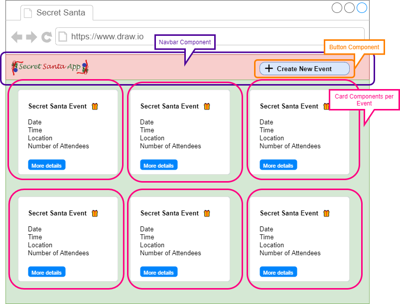
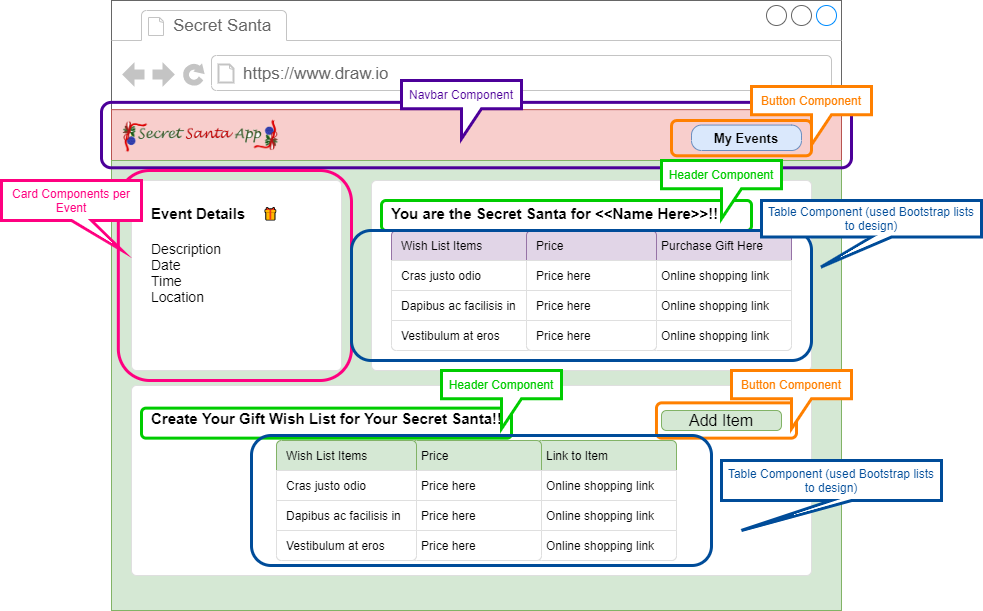
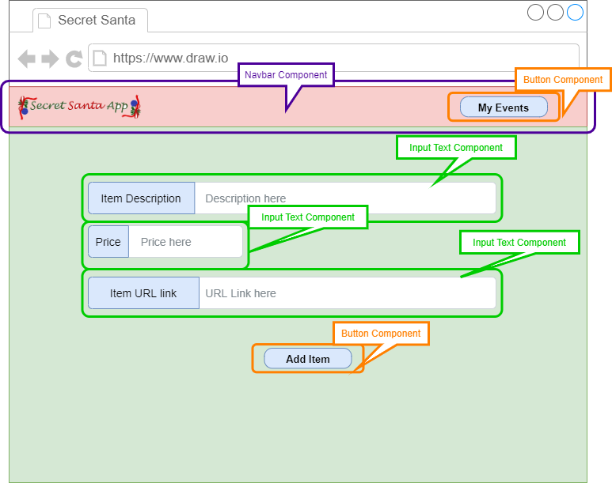

# Secret Santa App

---


<p align="center">
 
</p>

---

## Table of Contents

- [Project Concept](#project-concept)
- [Reference Links](#reference-links)
- [User Story](#user-story)
- [Application MVP](#application-mvp)
- [Design](#design)
  - [Actions Diagram](#actions-diagram)
  - [Sequence Diagrams](#sequence-diagrams)
  - [ER Diagram](#er-diagram)
  - [Wireframes](#wireframes)
- [Technologies Used for Development](#technologies-used-for-development)
  - [Core Technologies](#core-technologies)
  - [CircleCI and Code Climate](#circleci-and-code-climate)
- [Installation and Testing Instructions](#installation-and-testing-instructions)
  - [Required Technologies](#required-technologies)
  - [Installation Instructions](#installation-instructions)
  - [Testing Instructions](#testing-instructions)
- [Team Members](#team-members)

---

## Project Concept

The 2020 holiday season is quickly approaching! This Secret Santa App will help you orchestrate the holiday fan-favorite game, Secret Santa! With this app, the user will be able to do the following:

- Schedule a date for the secret santa gift exchange event
- Invite family and friends to join in on the holiday fun
- Keep track of who accepted the secret santa invite
- Discretely assign a single participant to each individual registered for the event
- Allow participants to create a list of gift ideas they would like to recieve

---

## Reference Links

Link to Secret Santa Application deployed on Heroku - [Secret Santa Application Live Link](https://secret-santa-platform.herokuapp.com/)

Link to GitHub Repo used for application development- [https://github.com/Holiday-Secret-Santa/Secret-Santa-App](https://github.com/Holiday-Secret-Santa/Secret-Santa-App)

Link to Project Board used for application development - [https://github.com/Holiday-Secret-Santa/Secret-Santa-App/projects/1](https://github.com/Holiday-Secret-Santa/Secret-Santa-App/projects/1)

---

## User Story

```
AS a user who needs to organize a secret santa gift exchange
I WANT to be able to use an online application
SO THAT I can prepare an awesome holiday event for friends and family
```

---

## Application MVP

Here is a list of the MVP requirements for this app. Please note that these are the same core functionality items listed in the project description section.

- The User can _register_, _login_ and _logout_
- The User can schedule a date for the secret santa gift exchange event
- The User can invite family and friends to join in on the holiday fun
- The User can keep track of who accepted the secret santa invite
- The User can discretely assign a single participant to each individual registered for the event
  - System offers option to do a random assignment (potential future development)
- The System allows participants to manually create a list of gift ideas they would like to recieve
  - When creating a wish list item, the participant will be able to add an item name and URL link for potential online purchase

---

## Design

### Actions Diagram

The flow chart below outlines the basic functionality of the secret santa app.

<details>
  <summary> 📓 Click to expand the functionality flow chart.</summary>


</details>

### Sequence Diagrams

The diagrams listed below outline the sequence of events required for the all key MVP features. These diagrams help visualize the interaction between the different components of the application.

**Flow to Create Secret Santa Gift Exchange Event**

<details>
  <summary> 📈 Click to expand the sequence diagram.</summary>

  

[Sequence Diagram Create Event Link](https://wire-dev-tools.mybluemix.net/sequence/?d=Title%3A+Create+Secret+Santa+Gift+Exchange+Event%0AUser--%3EUser+Interface%3A+Click+Create+button%0AUser+Interface--%3EUser%3A+Display+Exchange+Page%0AUser--%3EUser+Interface%3A+Enters+Data+and+Submit%0AUser+Interface--%3EUser+Interface%3A+Validates+Data%0ANote+right+of+User+Interface%3A+If+error%2C+display+message%0AUser+Interface--%3EServer+API%3A+Calls+create+event+API%0AServer+API--%3EServer+API%3A+Validates+Data%0ANote+right+of+Server+API%3A+If+error%2C+return+with+error%0AServer+API--%3EDatabase%3A+Save+new+event%0ADatabase--%3EServer+API%3A+Saved+event%0AServer+API--%3EUser+Interface%3A+Saved+event+json%0AUser+Interface--%3EUser+Interface%3A+Show+success+message%0AUser+Interface--%3EUser%3A+Redirect+to+list+of+events+page%0A++++++++++++&t=simple)

</details>

**Flow to Invite Guest to Exchange Event**

<details>
<summary> 📈 Click to expand the sequence diagram.</summary>

  

[Sequence Diagram Invite Guest](https://wire-dev-tools.mybluemix.net/sequence/?d=Title%3A+Invite+Guest+to+Exchange+Event%0AUser--%3EUser+Interface%3A+Click+Invite+button+%0AUser+Interface--%3EUser%3A+Display+Invite+Page%0AUser--%3EUser+Interface%3A+Enters+Data+and+Submit%0AUser+Interface--%3EUser+Interface%3A+Validates+Data%0ANote+right+of+User+Interface%3A+If+error%2C+display+message%0AUser+Interface--%3EServer+API%3A+Calls+send+invite+API%0AServer+API--%3EServer+API%3A+Validates+Data%0ANote+right+of+Server+API%3A+If+error%2C+return+with+error%0AServer+API--%3EDatabase%3A+Save+new+invite%0ADatabase--%3EServer+API%3A+Saved+invite%0AServer+API--%3EEmail+Platform%3A+Send+invite+email%0AServer+API--%3EUser+Interface%3A+Saved+invite+json%0AUser+Interface--%3EUser+Interface%3A+Show+success+message%0AUser+Interface--%3EUser%3A+Redirect+to+the+event+page&t=simple)

</details>

**Flow to Track Invitations**

<details>
<summary> 📈 Click to expand the sequence diagram.</summary>


[Sequence Diagram Track of Invitations](http://wire-dev-tools.mybluemix.net/sequence/?d=Title%3A+User+Keep+Track+of+Invitations%0AUser--%3EGuest%3A+Sends+Invite+Email+through+System%0AGuest--%3EEmail%3A+Clicks+link+on+email+invite%0AEmail--%3EUser+Interface%3A+Open+accepting+page%0AGuest--%3EUser+Interface%3A+Clicks+accept+invite%0AUser+Interface--%3EServer+API%3A+Calls+accept+invite+API%0AServer+API--%3EServer+API%3A+Validates+Data%0ANote+right+of+Server+API%3A+If+error%2C+return+with+error%0AServer+API--%3EDatabase%3A+Update+guest+invite+to+accepted%0ADatabase--%3EServer+API%3A+Saved+guest+invite%0AServer+API--%3EEmail+Platform%3A+Send+thanks+for+accepting+invite+and+calendar+reminder+email%0AServer+API--%3EUser+Interface%3A+Saved+guest+json%0AUser+Interface--%3EUser+Interface%3A+Show+success+message%0AUser+Interface--%3EGuest%3A+Asks+to+login+or+register+for+account%0ANote+right+of+Guest%3A+Only+logged+in+guests+can+add+gift+ideas%0AUser--%3EUser+Interface%3ASee+List+of+Guests%0AUser+Interface--%3EServer+API%3A+Calls+list+guests+API%0AServer+API--%3EDatabase%3A+Get+guest+list+w%2F+status%0ADatabase--%3EServer+API%3A+List+of+guests+w%2F+status%0AServer+API--%3EUser+Interface%3A+List+of+guests+w%2F+status%0AUser+Interface--%3EUser%3A+Display+guests+with+status&t=simple)

</details>

**Flow to Manually Assign Gift Exchange Guests**

<details>
<summary> 📈 Click to expand the sequence diagram.</summary>


[Sequence Diagram Manually Assign Gift Exchange Guests](http://wire-dev-tools.mybluemix.net/sequence/?d=Title%3A+User+Manually+Assign+Gift+Exchange+Guests%0AUser--%3EUser+Interface%3A+Click+Assign+Exchange+Guests+button%0AUser+Interface--%3EUser%3A+Display+Assign+Exchange+Guests+Page%0AUser--%3EUser+Interface%3A+Select+guest+and+gifting+guest%2C+click+save%0AUser+Interface--%3EUser+Interface%3A+Validates+Data%0ANote+right+of+User+Interface%3A+If+error%2C+display+message%0AUser+Interface--%3EServer+API%3A+Calls+assign+exchange+guest+API%0AServer+API--%3EServer+API%3A+Validates+Data%0ANote+right+of+Server+API%3A+If+error%2C+return+with+error%0AServer+API--%3EDatabase%3A+Assign+gifting+guest+to+guest%0ADatabase--%3EServer+API%3A+Saved+guest%0AServer+API--%3EEmail+Platform%3A+Send+email+to+gifting+guest+with+assignment+details%0AServer+API--%3EUser+Interface%3A+Saved+guest+json%0AUser+Interface--%3EUser+Interface%3A+Show+success+message&t=simple)

</details>

**Flow to use System to Auto Assign Gift Exchange Guests**

<details>
<summary> 📈 Click to expand the sequence diagram.</summary>


[Sequence Diagram System Assign Gift Exchange Guests](http://wire-dev-tools.mybluemix.net/sequence/?d=Title%3A+System+Auto+Assign+Gift+Exchange+Guests%0AUser--%3EUser+Interface%3A+Click+Assign+Exchange+Guests+button%0AUser+Interface--%3EUser%3A+Display+Assign+Exchange+Guests+Page%0AUser--%3EUser+Interface%3A+Select+system+auto+assignment%0AUser+Interface--%3EUser+Interface%3A+Validates+Data%0ANote+right+of+User+Interface%3A+If+error%2C+display+message%0AUser+Interface--%3EUser+Interface%3A+Confirms+this+will+override+previous+assignments%0AUser+Interface--%3EServer+API%3A+Calls+auto+assign+guests+API%0AServer+API--%3EServer+API%3A+Validates+Data%0ANote+right+of+Server+API%3A+If+error%2C+return+with+error%0A%0AServer+API--%3EDatabase%3A+Assign+gifting+guest+to+guest%0ADatabase--%3EServer+API%3A+Saved+guest%0AServer+API--%3EEmail+Platform%3A+Send+email+to+gifting+guest+with+assignment+details%0AServer+API--%3EUser+Interface%3A+Saved+guest+json%0AUser+Interface--%3EUser+Interface%3A+Show+success+message&t=simple)

</details>

**Flow for Guests to Add Gift Ideas**

<details>
<summary> 📈 Click to expand the sequence diagram.</summary>


[Sequence Diagram Guest Adds Gift Ideas](http://wire-dev-tools.mybluemix.net/sequence/?d=Title%3A+Guest+Adds+Gift+Ideas%0AGuest--%3EUser+Interface%3A+Guest+click+Events+Invitations+List%0AUser+Interface--%3EServer+API%3A+Calls+get+guest+events+API%0AServer+API--%3EDatabase%3A+Read+guest+events%0ADatabase--%3EServer+API%3A+Events+List%0AServer+API--%3EUser+Interface%3A+Events+List+json%0AUser+Interface--%3EGuest%3A+Display+Page+with+list+of+events+user+is+invited+as+guest%0AGuest--%3EUser+Interface%3A+Select+an+event+to+edit+gift+ideas%0AUser+Interface--%3EServer+API%3A+Calls+get+gift+ideas+details+API%0AServer+API--%3EDatabase%3A+Reads+gifts+ideas+for+event%0ADatabase--%3EServer+API%3A+Gifts+idea%0AServer+API--%3EUser+Interface%3A+Gifts+ideas+json%0AUser+Interface--%3EGuest%3A+Display+page+with+gifts+ideas%0AGuest--%3EUser+Interface%3A+Edit+ideas%0AGuest--%3EUser+Interface%3A+Search+for+ideas%0AUser+Interface--%3EServer+API%3A+Call+search+gifts+API%0AServer+API--%3EAmazon%3A+Search+gifts%0AServer+API--%3EUser+Interface%3A+List+of+products%0AUser+Interface--%3EGuest%3A+Display+gifts+results%0AGuest--%3EUser+Interface%3A+Pick+one+or+more+gifts%0AGuest--%3EUser+Interface%3A+Save+gifts+ideas%0AUser+Interface--%3EUser+Interface%3A+Validates+Data%0ANote+right+of+User+Interface%3A+If+error%2C+display+message%0AUser+Interface--%3EServer+API%3A+Calls+Save+gifts+ideas%0AServer+API--%3EServer+API%3A+Validates+Data%0ANote+right+of+Server+API%3A+If+error%2C+return+with+error%0AServer+API--%3EDatabase%3A+Save+gifts+ideas%0ADatabase--%3EServer+API%3A+Saved+gifts+ideas%0AServer+API--%3EEmail+Platform%3A+Send+email+to+gifting+guest+with+ideas+details%0AServer+API--%3EUser+Interface%3A+Success+result%0AUser+Interface--%3EUser+Interface%3A+Show+success+message&t=simple)

</details>

### ER Diagram

The entity relationship **(ER) diagram** below provides a visual representation of how the data is saved inside the application's back-end database. This diagram also demonstrates the relationship between each database table.

` The ER Diagram is based on the relations between the tables using SQL Self JOIN`

<details>
<summary> 📈 Click to expand the ERM diagram.</summary>

</details>

### Wireframes

#### Wireframes Applicable for All Users

The wireframes below are applicable for all users. In theory, any user should be able to access the homepage, login page, view all their events, and create an event. However, the event details wireframe will be different depending on whether the user is the `event organizer` or `invited guest`. The wireframes for event details specific to that role are provided below in separate sections.

##### Wireframe for Home page

<details>
<summary> 🎨 Click to expand the homepage wireframe.</summary>

  

</details>

##### Wireframe for Login page (Auth0-generated)

<details>
<summary> 🎨 Click to expand the login wireframe (Auth0-generated).</summary>

  

</details>

##### Wireframe for Dashboard of all Events

<details>
<summary> 🎨 Click to expand the event dashboard wireframe.</summary>

  

</details>

##### Wireframe for Creating a New Event

<details>
<summary> 🎨 Click to expand the create a new event wireframe.</summary>

  

</details>

#### Wireframes for Event Organizer Role

The wireframe below is for the `event organizer` role. The `event organizer` should be able to see all the event details, the number of attendees invited, RSVP status, and the secret santa assignment for each `invited guest` participating in the secret santa.

##### Wireframe for Viewing Specific Event (Organizer Role)

<details>
<summary> 🎨 Click to expand the event details wireframe.</summary>

  

</details>

##### Wireframe for Viewing Secret Santa Assignments (Organizer Role)

This wireframe was designed for the main MVP functionality that will allow for manual secret santa assignment.

<details>
<summary> 🎨 Click to expand the secret santa assignment wireframe.</summary>

  

</details>

#### Wireframes for Invited Guest Role

The wireframe below is for the `invited guest` role. The `invited guest` should **_only_** be able to see the event details, whether they have been assigned a secret santa (but not the secret santa's name).

##### Wireframe for Accepting Invite

If **_user accepts_** the invite, then the `accept` button should take them to the login page so they can see the event in their person event's dashboard.

If the **_user declines_** the invite, then the user will be redirected to the homepage of the app.

<details>
<summary> 🎨 Click to expand the accept invite wireframe.</summary>

  

</details>

##### Wireframe for Viewing Specific Event (Invited Guest Role)

<details>
<summary> 🎨 Click to expand the event details wireframe.</summary>

  

</details>

##### Wireframe for Adding an Wish List Item

Please note that the when the user clicks the `Add Item Button` on the event details page, they will be redirected to the wireframe below.

<details>
<summary> 🎨 Click to expand the wireframe for adding a wish list item.</summary>

  

</details>

## Technologies Used for Development

Here is a list of the core technologies we used for the development of this application.

### Core Technologies

Here is a list of core technologies that were used to develop this web application:

| Technologies | Description                                                                                              |
| ------------ | -------------------------------------------------------------------------------------------------------- |
| HTML         | Used to design the basic website structre                                                                |
| JavaScript   | Used to add functionality to the application                                                             |
| CSS          | Used to add custom styling to the application                                                            |
| Ant Design   | React UI component library used to design this React-based application                                   |
| React.js     | Javascript library used to design the front-end of this application                                      |
| Node.js      | Used to establish the back-end server environment for this application (also utilized many NPM packages) |
| SQL          | Application database is designed and quered using SQL and Sequelize                                      |
| Nodemailer   | Package used to emable auto sending of emails to added pariticipants                                     |
| GraphQL      | Used this query language for API interaction                                                             |
| CircleCI     | Used to monitor embedded unit tests.                                                                     |
| Code Climate | Used to monitor and test code quality (i.e. consistent coding best practices)                            |

### CircleCI and Code Climate

#### CircleCI

While developing this application, the team integrated CircleCI into this repository to automatically monitor added unit testing included throughout the application. Please visit the [CircleCi documentation](https://circleci.com/) for additional instruction on how to integrate the CircleCI tool.

#### Code Climate

In addition to CircleCi, the team also incorporated Code Climate monitoring services into this repository to ensure the overall code quality developed by the team met coding best practices. Please visit the [Code Climate](https://codeclimate.com/) for additional instruction on how to integrate the Code Climate tool.

##### IMPORTANT FYI for Package.json Files

This project contains two `package.json` files - one at the root directory and another in the client folder.

In order to resolve coverage issues / limitations associated with Code Climate running coverage reports this full-stack application, the team had to **_intentionally_** include front-end dev dependencies in the root `package.json` file to ensure all frontend and backend tests are run from the single root `package.json` file.

I am including this update to make it clear that we are aware react-related dependencies are typically only needed in the frontend portion and an application; however, the approach we used in this repository was used to work around Code Climate limitations.

#### GraphQL

Instead of using a traditional promise-based HTTP client to pull data from a database, the team used [GraphQL](https://graphql.org/) to make the API calls to our SQL-based backend database. When using GraphQL, we had the ability to specify the specific data items within a single call without using lengthy endpoints and axios calls.

In addition, GraphQL does not require you to use PostMan to test database call, and instead uses it own sandbox environment by simply adding `/graphql` to the end of the port address being used to locally launch the application. For example, instead of using `http://localhost:3001/`, you would use `http://localhost:3001/grqphql` to interact with the graphql sandbox environment. The image below shows the graphql sandbox environment and include a sample graphql query that the team used to query wish list items added by participants.


---

## Installation and Testing Instructions

### Required Technologies

In order to success launch this web application, you will need to have the following installed in your local working environment:

- **Node.js** - Make sure Node.js is installed in your machine. If Node.js is not installed on your machine, [click here](https://nodejs.org/en/) to download the application.

### Installation Instructions

All NPM packages needed for this application are already listed as dependencies in the package.json file. If running this web application in your local environment, please make sure to run the `npm install` command in your terminal for **_both_** the `root directory` and `client folder` in order to access all required package.

### Testing Instructions

When checking to see if all applicable unit tests pass throughout the development of this application, make sure to run the `npm run test` command in your terminal each time you would like to test the application. The team used the [Jest Testing Framework](https://jestjs.io/) to build all unit test for this application.

There are a total of 64 passing unit test incorporated for this application, which results in 87 percent test coverage for the entire application.


---

## Team Members

- [Krystal Duran](https://github.com/KEDuran)
- [Yadira Tamarit](https://github.com/ystamaritq)
- [Joshua Martinez](https://github.com/JDMartinez1531)
- [Valeria Gonzalez Layva](https://github.com/valeglezleyva)

---

[Table of Contents](#table-of-contents)
